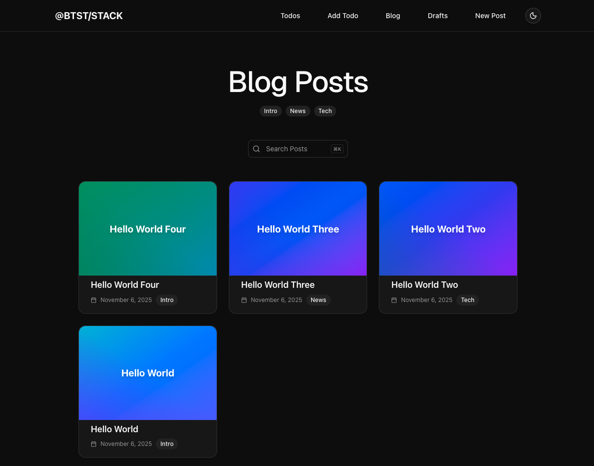

import { Tabs, Tab } from "fumadocs-ui/components/tabs";
import { Callout } from "fumadocs-ui/components/callout";




## Installation

Follow these steps to add the Blog plugin to your Better Stack setup.


### 1. Add Plugin to Backend API

Import and register the blog backend plugin in your `better-stack.ts` file:

```ts title="lib/better-stack.ts"
import { betterStack } from "@btst/stack"
import { blogBackendPlugin } from "@btst/stack/plugins/blog/api"
// ... your adapter imports

const { handler, dbSchema } = betterStack({
  basePath: "/api/data",
  plugins: {
    blog: blogBackendPlugin() // Hooks are optional
  },
  adapter: (db) => createPrismaAdapter(prisma, db, { 
    provider: "postgresql" 
  })
})

export { handler, dbSchema }
```

The `blogBackendPlugin()` accepts optional hooks for customizing behavior (authorization, logging, etc.). You can pass an empty object or omit it entirely to use defaults.

### 2. Add Plugin to Client

Register the blog client plugin in your `better-stack-client.tsx` file:

```tsx title="lib/better-stack-client.tsx"
import { createStackClient } from "@btst/stack/client"
import { blogClientPlugin } from "@btst/stack/plugins/blog/client"
import { QueryClient } from "@tanstack/react-query"

const getBaseURL = () => 
  typeof window !== 'undefined' 
    ? (process.env.NEXT_PUBLIC_BASE_URL || window.location.origin)
    : (process.env.BASE_URL || "http://localhost:3000")

export const getStackClient = (queryClient: QueryClient) => {
  const baseURL = getBaseURL()
  return createStackClient({
    plugins: {
      blog: blogClientPlugin({
        // Required configuration
        apiBaseURL: baseURL,
        apiBasePath: "/api/data",
        siteBaseURL: baseURL,
        siteBasePath: "/pages",
        queryClient: queryClient,
        // Optional: SEO configuration
        seo: {
          siteName: "My Blog",
          author: "Your Name",
          twitterHandle: "@yourhandle",
          locale: "en_US",
          defaultImage: `${baseURL}/og-image.png`,
        },
      })
    }
  })
}
```

**Required configuration:**
- `apiBaseURL`: Base URL for API calls during SSR data prefetching (use environment variables for flexibility)
- `apiBasePath`: Path where your API is mounted (e.g., `/api/data`)
- `siteBaseURL`: Base URL of your site
- `siteBasePath`: Path where your pages are mounted (e.g., `/pages`)
- `queryClient`: React Query client instance

<Callout type="info">
**Why configure API paths here?** This configuration is used by **server-side loaders** that prefetch data before your pages render. These loaders run outside of React Context, so they need direct configuration. You'll also provide `apiBaseURL` and `apiBasePath` again in the Provider overrides (Section 4) for **client-side components** that run during actual rendering.
</Callout>

### 3. Import Plugin CSS

Add the blog plugin CSS to your global stylesheet:

```css title="app/globals.css"
@import "tailwindcss";

/* Import blog plugin styles */
@import "@btst/stack/plugins/blog/css";
```

This includes all necessary styles for the blog components, markdown rendering, and editor.

### 4. Add Context Overrides

Configure framework-specific overrides in your `BetterStackProvider`:

<Tabs groupId="frameworks" items={["next-js", "react-router", "tanstack"]} persist>
  <Tab value="next-js">
    ```tsx title="app/pages/[[...all]]/layout.tsx"
    import { BetterStackProvider } from "@btst/stack/context"
    import type { BlogPluginOverrides } from "@btst/stack/plugins/blog/client"
    import Link from "next/link"
    import Image from "next/image"
    import { useRouter } from "next/navigation"

    const getBaseURL = () => 
      typeof window !== 'undefined' 
        ? (process.env.NEXT_PUBLIC_BASE_URL || window.location.origin)
        : (process.env.BASE_URL || "http://localhost:3000")

    type PluginOverrides = {
      blog: BlogPluginOverrides
    }

    export default function Layout({ children }) {
      const router = useRouter()
      const baseURL = getBaseURL()
      
      return (
        <BetterStackProvider<PluginOverrides>
          basePath="/pages"
          overrides={{
            blog: {
              apiBaseURL: baseURL,
              apiBasePath: "/api/data",
              navigate: (path) => router.push(path),
              refresh: () => router.refresh(),
              uploadImage: async (file) => {
                // Implement your image upload logic
                // Return the URL of the uploaded image
                return "https://example.com/uploads/image.jpg"
              },
              Link: (props) => <Link {...props} />,
              Image: (props) => <Image {...props} />,
            }
          }}
        >
          {children}
        </BetterStackProvider>
      )
    }
    ```
  </Tab>

  <Tab value="react-router">
    ```tsx title="app/routes/pages/_layout.tsx"
    import { Outlet, Link, useNavigate } from "react-router"
    import { BetterStackProvider } from "@btst/stack/context"
    import type { BlogPluginOverrides } from "@btst/stack/plugins/blog/client"

    const getBaseURL = () => 
      typeof window !== 'undefined' 
        ? (import.meta.env.VITE_BASE_URL || window.location.origin)
        : (process.env.BASE_URL || "http://localhost:5173")

    type PluginOverrides = {
      blog: BlogPluginOverrides
    }

    export default function Layout() {
      const navigate = useNavigate()
      const baseURL = getBaseURL()
      
      return (
        <BetterStackProvider<PluginOverrides>
          basePath="/pages"
          overrides={{
            blog: {
              apiBaseURL: baseURL,
              apiBasePath: "/api/data",
              navigate: (href) => navigate(href),
              uploadImage: async (file) => {
                // Implement your image upload logic
                return "https://example.com/uploads/image.jpg"
              },
              Link: ({ href, children, className, ...props }) => (
                <Link to={href || ""} className={className} {...props}>
                  {children}
                </Link>
              ),
            }
          }}
        >
          <Outlet />
        </BetterStackProvider>
      )
    }
    ```
  </Tab>

  <Tab value="tanstack">
    ```tsx title="src/routes/pages/route.tsx"
    import { BetterStackProvider } from "@btst/stack/context"
    import type { BlogPluginOverrides } from "@btst/stack/plugins/blog/client"
    import { Link, useRouter, Outlet } from "@tanstack/react-router"

    const getBaseURL = () => 
      typeof window !== 'undefined' 
        ? (import.meta.env.VITE_BASE_URL || window.location.origin)
        : (process.env.BASE_URL || "http://localhost:3000")

    type PluginOverrides = {
      blog: BlogPluginOverrides
    }

    function Layout() {
      const router = useRouter()
      const baseURL = getBaseURL()

      return (
        <BetterStackProvider<PluginOverrides>
          basePath="/pages"
          overrides={{
            blog: {
              apiBaseURL: baseURL,
              apiBasePath: "/api/data",
              navigate: (href) => router.navigate({ href }),
              uploadImage: async (file) => {
                // Implement your image upload logic
                return "https://example.com/uploads/image.jpg"
              },
              Link: ({ href, children, className, ...props }) => (
                <Link to={href} className={className} {...props}>
                  {children}
                </Link>
              ),
            }
          }}
        >
          <Outlet />
        </BetterStackProvider>
      )
    }
    ```
  </Tab>
</Tabs>

**Required overrides:**
- `apiBaseURL`: Base URL for API calls (used by client-side components during rendering)
- `apiBasePath`: Path where your API is mounted
- `navigate`: Function for programmatic navigation
- `uploadImage`: Function to upload images and return their URL

**Optional overrides:**
- `Link`: Custom Link component (defaults to `<a>` tag)
- `Image`: Custom Image component (useful for Next.js Image optimization)
- `refresh`: Function to refresh server-side cache (useful for Next.js)
- `localization`: Custom localization strings
- `showAttribution`: Whether to show Better Stack attribution

<Callout type="warn">
**Why provide API paths again?** You already configured these in Section 2, but that configuration is only available to **server-side loaders**. The overrides here provide the same values to **client-side components** (like hooks, forms, and UI) via React Context. These two contexts serve different phases: loaders prefetch data server-side before rendering, while components use data during actual rendering (both SSR and CSR).
</Callout>

### 5. Generate Database Schema

After adding the plugin, generate your database schema using the CLI:

```bash
npx @btst/cli generate --orm prisma --config lib/better-stack.ts
```

This will create the necessary database tables for posts and tags. Run migrations as needed for your ORM.

For more details on the CLI and all available options, see the [CLI documentation](/cli).

## Customization

### Backend Hooks

Customize backend behavior with optional hooks. All hooks are optional and allow you to add authorization, logging, and custom behavior:

<AutoTypeTable path="../packages/better-stack/src/plugins/blog/api/plugin.ts" name="BlogBackendHooks" />

**Example usage:**

```ts title="lib/better-stack.ts"
import { blogBackendPlugin, type BlogBackendHooks } from "@btst/stack/plugins/blog/api"

const blogHooks: BlogBackendHooks = {
  // Authorization hooks - return false to deny access
  onBeforeListPosts: async (filter, context) => {
    // Control access to post lists (e.g., hide drafts from public)
    if (filter.published === false) {
      // Require authentication for drafts
      return false // or check auth
    }
    return true
  },
  // ... other hooks
}

const { handler, dbSchema } = betterStack({
  plugins: {
    blog: blogBackendPlugin(blogHooks)
  },
  // ...
})
```

### Client Hooks

Customize client-side behavior with hooks. These hooks are called during data fetching (both SSR and CSR):

<AutoTypeTable path="../packages/better-stack/src/plugins/blog/client/plugin.tsx" name="BlogClientHooks" />

**Example usage:**

```tsx title="lib/better-stack-client.tsx"
blog: blogClientPlugin({
  // ... required config
  hooks: {
    beforeLoadPosts: async (filter, context) => {
      console.log("Loading posts:", filter)
      return true // Return false to cancel loading
    },
    // ... other hooks
  }
})
```

### Plugin Overrides

Configure framework-specific overrides and route lifecycle hooks. All lifecycle hooks are optional:

<AutoTypeTable path="../packages/better-stack/src/plugins/blog/client/overrides.ts" name="BlogPluginOverrides" />

**Example usage:**

```tsx
overrides={{
  blog: {
    // Required overrides
    apiBaseURL: baseURL,
    apiBasePath: "/api/data",
    navigate: (path) => router.push(path),
    uploadImage: async (file) => {
      // Implement your image upload logic
      return "https://example.com/uploads/image.jpg"
    },
    // Optional lifecycle hooks
    onBeforePostsPageRendered: (context) => {
      // Check if user can view posts list
      return true
    },
    // ... other hooks
  }
}}
```

### Client Configuration

The client plugin accepts a configuration object with required fields and optional SEO settings:

<AutoTypeTable path="../packages/better-stack/src/plugins/blog/client/plugin.tsx" name="BlogClientConfig" />

**Example usage:**

```tsx title="lib/better-stack-client.tsx"
blog: blogClientPlugin({
  // Required configuration
  apiBaseURL: baseURL,
  apiBasePath: "/api/data",
  siteBaseURL: baseURL,
  siteBasePath: "/pages",
  queryClient: queryClient,
  // Optional SEO configuration
  seo: {
    siteName: "My Awesome Blog",
    author: "John Doe",
    twitterHandle: "@johndoe",
    locale: "en_US",
    defaultImage: `${baseURL}/og-image.png`,
  },
})
```

## Understanding the Architecture

The Blog plugin uses a **two-phase configuration** pattern to handle both server-side data prefetching and client-side rendering:

```
┌─────────────────────────────────────────────────────────────┐
│ Phase 1: Server-Side Data Prefetching (SSR Loaders)         │
│                                                             │
│  Uses: BlogClientConfig (Section 2)                         │
│  Purpose: Prefetch data into React Query cache              │
│  Context: Runs before React components mount                │
│  Access: Direct function parameters                         │
└─────────────────────────────────────────────────────────────┘
                           ↓
┌─────────────────────────────────────────────────────────────┐
│ Phase 2: Component Rendering (SSR + CSR)                    │
│                                                             │
│  Uses: BlogPluginOverrides (Section 4)                      │
│  Purpose: Runtime component behavior and API calls          │
│  Context: React components during render                    │
│  Access: React Context via usePluginOverrides hook          │
└─────────────────────────────────────────────────────────────┘
```

**Why two configs?** Loaders run **before** React Context is available, so they need direct configuration. Components run **during** render with React Context available, so they use Provider overrides. Both need `apiBaseURL`/`apiBasePath` but in different contexts.
